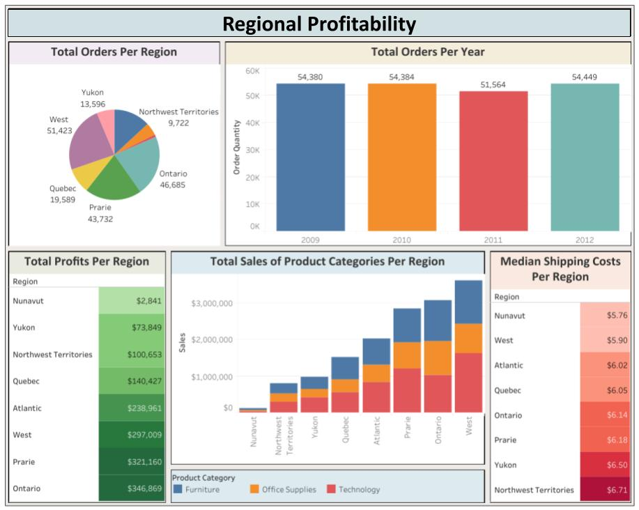

# Aman Shaikh's Projects

## Project 1: Product Sales Analysis (Excel Dashboard, Pivot Tables, Charts, and Slicers)
Utilizing the tools and resources on Microsoft Excel, multiple components were incorporated to create an interactive dashboard, such as pivot tables, charts, and functions. The data concentrated on products that were being sold throughout different countries in 2013 and 2014. The dashboard contains a total of four visualizations constructed by using the information that was obtained through the pivot tables. To display the simple text card with total profits, a function was inserted into a merged cell to copy the value from one of the pivot tables, and it adjusts every time profits are added or subtracted. In addition to the charts, slicers were implemented to filter items in each category. The necessary elements were emphasized through this Microsoft Excel dashboard.

### Key Insights:
- Paseo had the highest units sold compared to the other products (338,240 units). 
- Mexico had the lowest total sales in 2013 and 2014 (~$20 Million). 
- There is no correlation between the average sales price and units sold for the product.

## Project 2: Regional Profitability (Tableau Data Visualization)
With the integration of Tableau’s functionalities, a dashboard was customized with five visualizations to show the positive and negative trends of the sales data. The data included valuable information of the sales from a company throughout 2009 to 2012, and it specifically focused on the recorded sales throughout the different regions in Canada. Through the implementation of charts and graphs, it highlighted the key components of the dataset, such as the total number of sales for each product category or profits made throughout the years. The important pieces of the sales data were constructively put together into the Tableau dashboard.

### Key Insights:
- Among the regions in Canada, West recorded the highest number of orders and sales throughout the years (51,423 orders, ~$3.5 Million). 
- Ontario produced the highest profits of $346,869 after taking into consideration the shipping costs. 
- The total number of orders have remained stagnant between the range of 50,000 and 55,000 orders throughout the years.

